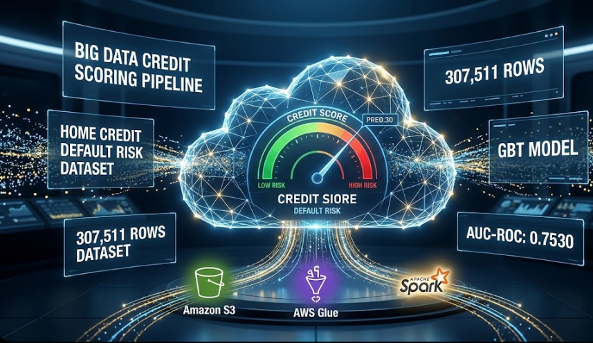
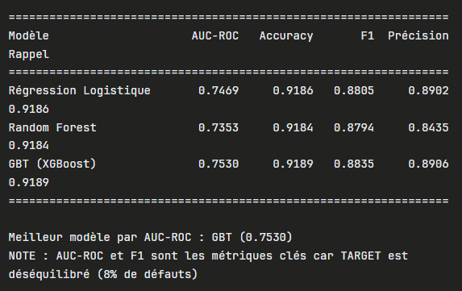

# 🏦 Home Credit Default Risk - Pipeline Big Data & Spark ML

## 🌟 Présentation du Projet
Ce projet vise à prédire le risque de défaut de paiement pour des crédits à la consommation en utilisant un environnement Big Data. L'enjeu est de traiter des millions de lignes provenant de 7 sources différentes pour identifier les profils à risque.

## 🏗️ Architecture et Outils
* **Stockage :** Amazon S3 (Data Lake au format Parquet).
* **ETL :** AWS Glue pour la fusion et la transformation des données via Apache Spark.
* **Machine Learning :** PySpark & MLlib pour la création de pipelines de modélisation automatisés.

## 🔄 Étape 1 : Pipeline ETL (Extract, Transform, Load)
Le projet repose sur trois Jobs Glue (`job1.py`, `job2.py`, `job3.py`) qui fusionnent progressivement les données tout en garantissant l'intégrité de la population.
* **Volume final :** 307 511 lignes traitées sans perte de données.

## 🧪 Étape 2 : Feature Engineering
Avant la modélisation, un nettoyage rigoureux a été effectué (suppression des caractères spéciaux via Regex). 
* **Variables identifiées :** 136 features au total (16 numériques et 120 catégorielles).
* **Traitement :** Imputation par la médiane pour les valeurs manquantes et encodage One-Hot pour les catégories.

## 🤖 Étape 3 : Modélisation et Résultats
Trois modèles ont été entraînés et comparés sur Spark : la Régression Logistique, le Random Forest et le GBT.
* **Meilleur Modèle :** Gradient Boosted Trees (GBT).
* **Performance :** AUC-ROC de **0.7530**.

## 📂 Structure du Dépôt
* `job1.py`, `job2.py`, `job3.py` : Scripts ETL de préparation.
* `ML credit scoring final.ipynb` : Notebook complet de modélisation.
* `/images` : Captures d'écran des résultats techniques.

---
*Projet réalisé dans le cadre d'une étude sur le Big Data et le Machine Learning distribué.*
